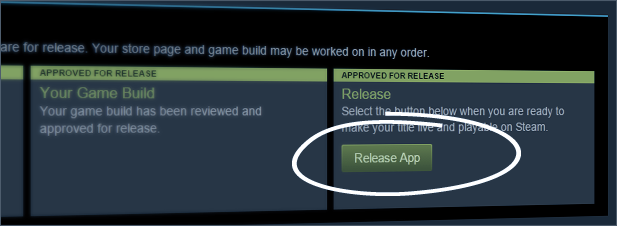

Build your skills before building your game. You need confidence and a proven track record of completing projects, so start small and work your way up.

Avoid getting overwhelmed or directionless by planning your project thoroughly and breaking it down into achievable goals. This will keep you on track and prevent setbacks.

Identify the most important tasks and prioritize them. This will help you make progress quickly and avoid getting bogged down in less important details.

Perfectionism can hinder your progress, as it leads to endless tweaking and polishing. Focus on creating something "good enough" to release.

Remember, you're building skills, not just a game. You have to keep pushing forward until you find a solution.