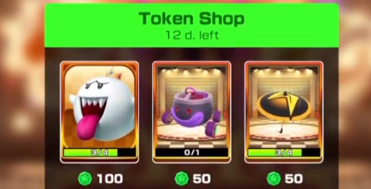

Masahiro Sakurai [published a video](https://www.youtube.com/watch?v=SpwQkNzNsXk) where he mentioned that rewards should be the first thing you consider. However, this videos lacks cruicial information.

Yes, you should consider rewards, but to do that you need to know what your risks are. It's possible that you don't have awareness what rewards truly are. Put simply, rewards exist to mitigate risks. If a reward doesn't reduce a risk, then it's not a reward.

Consider a hypothetical scenario in an action game where you're a power-seeking player. You complete a quest and earn 400 house coins that you can use to customize your in-game house's appearance. If you don't care about this reward, it's simply not a true reward since it doesn't mitigate any of your risk.

Games must have a core constant risk, also known as a failure state, to make their rewards worthwhile.

In Vampire Survivors, for example, players are at constantly at risk of dying. If a player dies, they reach their failure state, and it's game over. When a player kills an enemy, they mitigate the risk of dying, which is a reward in itself. Similarly, leveling up provides power that makes easier to mitigate the risk of death.

Alongside the constant risk, some games may have optional risks. In Mario Kart Tour, for instance, during an event tokens would be placed throughout a race course. A player interested in unlocking an event cosmetic, has the optional risk of not unlocking the item they want.

Collecting tokens for this player would mitigate the risk of taking too long or even being unable to unlock the item. However, for a player who doesn't care about the item, collecting those tokens are not valuable and therefore not a reward.

The core risk of a game defines its stress baseline. Comparing a high-risk game like Devil Daggers to a low-risk one like The Sims makes this difference evident. Both games have constant core risks, but one is easier to mitigate than the other, to the point where risks barely need to be considered while playing.

To create a well-designed game, rewards should mitigate one or more risks. Vampire Survivors did an impressive job of consistently aligning rewards with risks to enhance the core experience. While their specific methods may not have been perfect, the game succeeded in effectively mitigating their core risk through a variety of optional risks and rewards, ultimately resulting in a cohesive and engaging gameplay.

Rather than mindlessly adding rewards, it's essential to consider your risks and how to decrease the factors that increase them to use it as a reward. The key word here is decrease, removing your core risk would leave only optional ones and turn a game into a sandbox.

Sandbox or invulnerable state can be fulfilling and rewarding at some point, but it falls off quickly. Have you ever wondered why games become boring after using cheats to escape the risks you're facing? Without a ore constant risk, the rewards lose their purpose.

Therefore, when creating a game, use your rewards as risk mitigators. Understand what your risks truly are, and how to use them to your benefit.